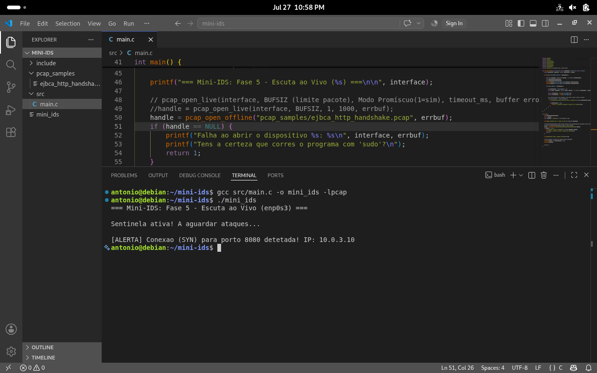
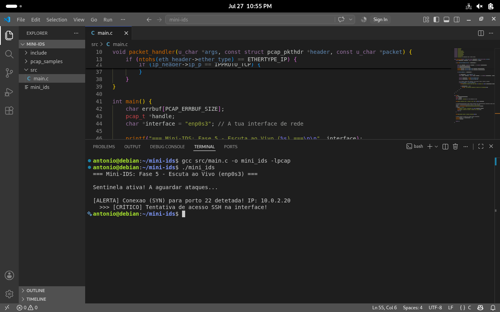
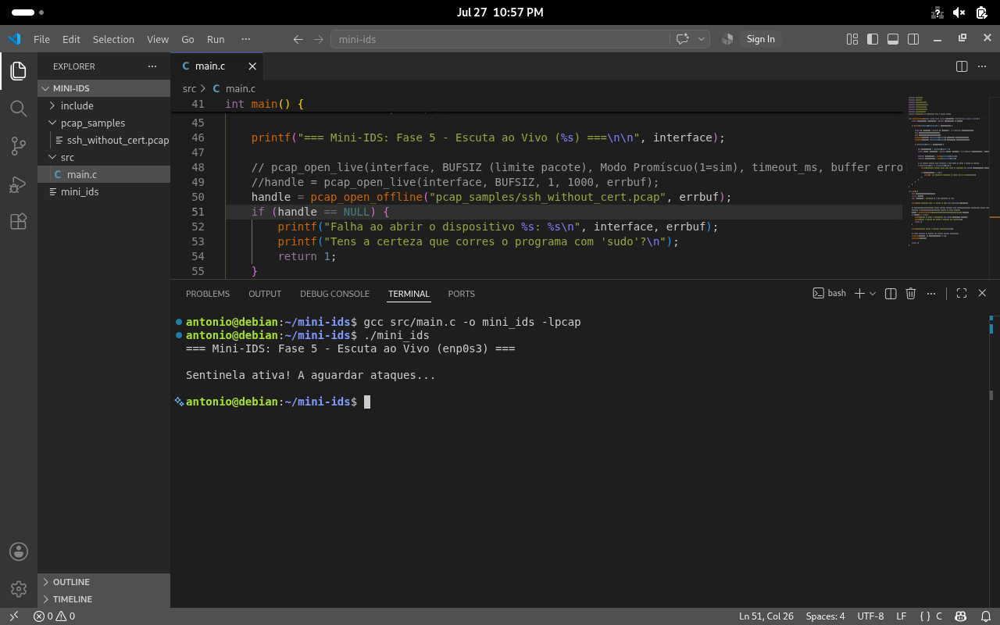
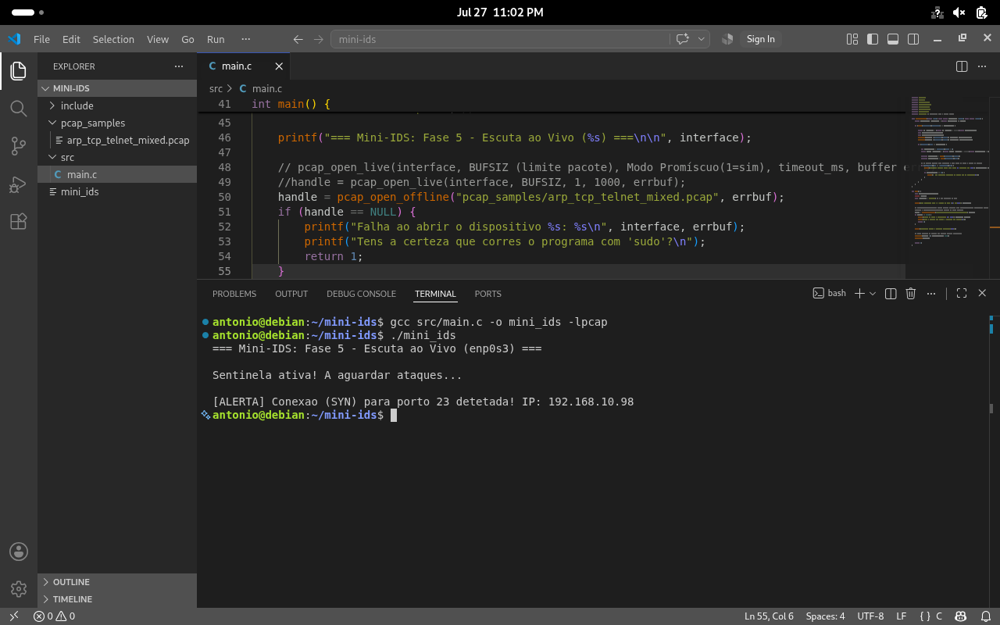

# Mini-IDS: C-based Network Intrusion Detection System (Part 1)

Este projeto consiste no desenvolvimento de um Sistema de Deteção de Intrusões (IDS) construído de raiz em **C**, utilizando a biblioteca `libpcap`. O objetivo central desta Fase 1 é demonstrar a desconstrução manual dos cabeçalhos da stack TCP/IP (Camadas 2, 3 e 4 do modelo OSI) através de aritmética de ponteiros, sem recurso a analisadores de alto nível pré-construídos.

## 🧠 Arquitetura Core (Motor de Captura e Parsing)
O motor foi desenhado para atuar em duas frentes distintas:
1. **Offline PCAP Analysis:** Processamento estático de capturas de rede, ideal para análise forense.
2. **Live Promiscuous Capture:** Interceção e análise de tráfego em tempo real na interface física ou virtual.

A desconstrução dos pacotes (*parsing*) é feita mapeando diretamente as estruturas de memória do kernel Linux (`ether_header`, `ip`, `tcphdr`), permitindo extrair endereços IP, portos de comunicação e analisar *flags* de estado (ex: identificação de tentativas de conexão através da flag TCP SYN).

## 🚀 Funcionalidades Atuais
* Leitura estruturada de pacotes a nível do bit.
* Identificação e extração de IPs (IPv4).
* Monitorização da Camada de Transporte (TCP) e identificação de serviços em uso.
* Motor de regras de deteção de anomalias baseado em *flags* TCP.

## 📸 Demonstração

**Demonstração do Motor ao Vivo (Live Promiscuous Capture):**
Neste vídeo, o Mini-IDS monitoriza ativamente a interface de rede, detetando e alertando para inícios de sessão TCP (SYN) em tempo real.


https://github.com/user-attachments/assets/66b989b4-cde2-47f9-9d09-db9f6704ec4c


**Deteção de Inicialização HTTP num ambiente EJBCA:**



**Análise de tentativas de conexão SSH (Com Certificado):**



**Análise de tentativas de conexão SSH (Sem Certificado):**



**Monitorização em tráfego misto (ARP, TCP e Telnet):**



## ⚙️ Compilação e Execução

### Dependências
Para compilar este projeto, é necessário o compilador GCC e a biblioteca de desenvolvimento libpcap no sistema Linux (Debian/Ubuntu):
```bash
sudo apt update
sudo apt install gcc make libpcap-dev
